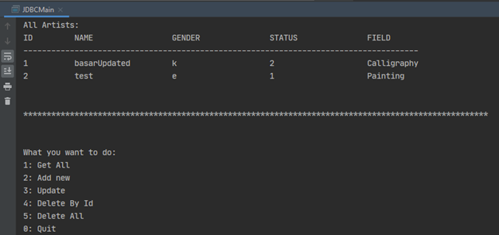

# JDBC Workspace  
  
Aim of this project is making database operations using `JDBC`  with  `PostgreSQL` database

**To work with JDBC:**
- You should install related driver (PostgreSQL JDBC Driver)
- Add driver to source folder and add it as dependency (in IntelliJ IDEA: <b> Project Structure -> Modules -> + (near
 scope) -> find the path -> export </b>)
- Create connection with specifying server adress, database name, client name and password and finally connection url

## Here are the outputs of the program
 

